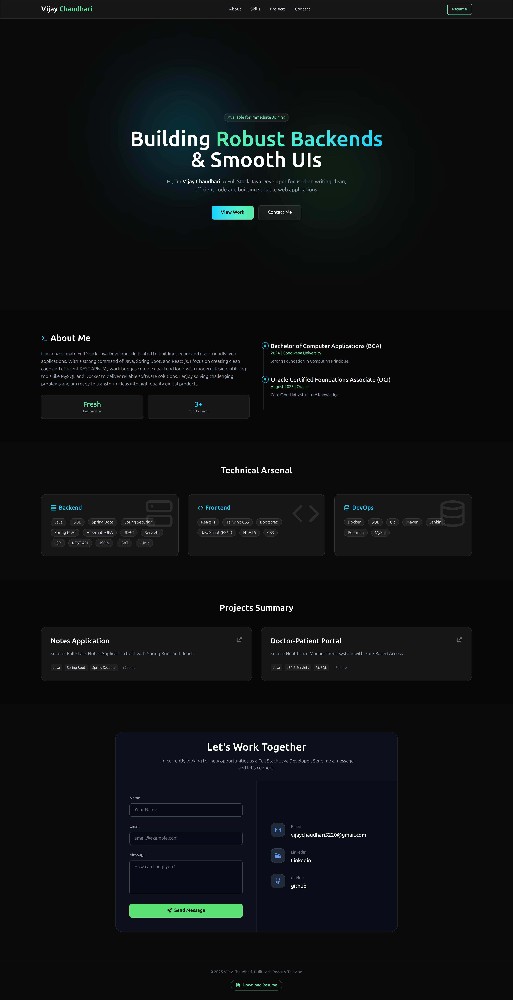

<div align="center">
  
  <h1>Welcome to My Portfolio</h1>
  <p><strong>The Source Code Behind My Digital Identity</strong></p>

  <a href="YOUR_NETLIFY_OR_LIVE_LINK_HERE">
    
  </a>
  <a href="https://www.linkedin.com/in/vijay-achaudhari/">
    
  </a>
</div>

---

## About Me
**Hi, I'm a Full Stack Java Developer!** I am a passionate fresher with hands-on experience in **Spring Boot, React.js, JSP/Servlets, and MySQL**. I enjoy building clean, efficient applications and have solid skills in creating REST APIs, implementing authentication, and deploying projects using **Docker and Maven**. 

My goal is to design full-stack applications that are reliable, user-friendly, and solve real-world problems.

---

## Portfolio Preview
> *A glimpse of my responsive portfolio website.*

<div align="center">
  
</div>

---

## My Technical Stack
*I don't just write code; I build ecosystems.*

| **Category** | **Technologies** |
| :--- | :--- |
| **Backend** |    |
| **Frontend** |    |
| **Database** |  |
| **DevOps** |   |

---

## Website Features
This portfolio is built to be fast, responsive, and professional.

* **Modern UI/UX:** Built with React & Tailwind CSS for a smooth experience.
* **📱 Fully Responsive:** Looks great on Mobile, Tablet, and Desktop.
* **Project Showcase:** Dedicated section for my Notes App & Doctor Portal.
* **Resume Download:** One-click access to my updated CV.
* **M Email Integration:** Functional contact form to reach me directly.

---

## How to Run Locally

If you want to check the code on your local machine:

1.  **Clone the repo:**
    ```bash
    git clone [https://github.com/techiviju/Portfolio.git](https://github.com/techiviju/Portfolio.git)
    ```
2.  **Navigate to the folder:**
    ```bash
    cd Portfolio
    ```
3.  **Install dependencies:**
    ```bash
    npm install
    ```
4.  **Start the server:**
    ```bash
    npm start
    ```

---

## Get In Touch

I am currently **Open to Work** for Full Stack Java Developer roles.

* **Email:** vijaychaudhari5220@gmail.com
* **LinkedIn:** .[LinkedIn](https://www.linkedin.com/in/vijay-achaudhari/)

---
<div align="center">
  <p>⭐️ <strong>If you like my work, please give this repo a Star!</strong> ⭐️</p>
</div>